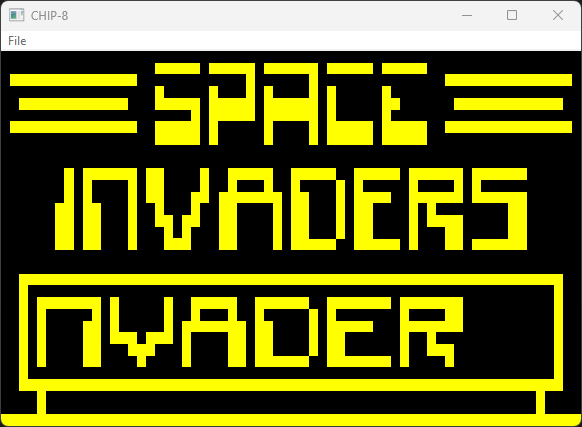
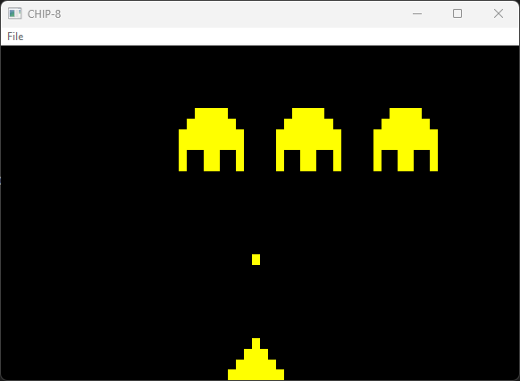

# CHIP-8 emulator
CHIP-8 emulator written in C++ for the purpose of learning about emulation.

## Screenshots

## Requirements
- Visual Studio
- CMake
- SDL2. Download [SDL2-devel-2.26.3-VC.zip](https://github.com/libsdl-org/SDL/releases/download/release-2.26.3/SDL2-devel-2.26.3-VC.zip) and extract it in the `thirdparty` folder before opening the project in Visual Studio.

## Compilation
Open folder in Visual Studio and compile, the output folder is configured to be `project/build/Debug|Release`

## References
[CHIP-8 Wikipedia](http://en.wikipedia.org/wiki/CHIP-8)
